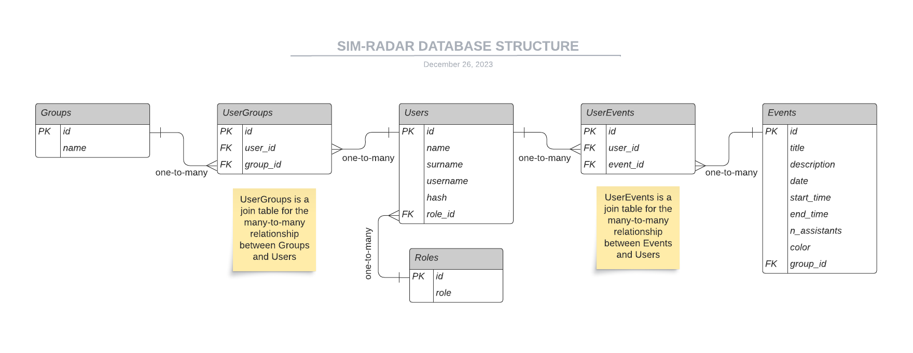

# SIM-RADAR

SIM-Radar is a web application designed to facilitate the management of participation in activities held at the simulation center. With a calendar feature, administrators can create events, each with a designated maximum capacity, while participants have the ability to sign up for the events of their choice. This platform enables administrators to access and oversee the list of participants for each event, streamlining the process of coordinating and tracking participation effectively.s

## Running instructions in development mode:

1. Create repository in your local server.
2. Clone the repository using `git clone https://github.com/iago2900/CalendarioSimulacion.git`
3. Create your virtual environment using `virtualenv env`
4. Init the virtual environment `env/Scripts/activate`
5. Install the required dependencies using `pip install -r requirements.txt`
7. Run with development configurations: 
    * Go to `app/__init__.py` and set development configurations: `app.config.from_object("config.DevConfig")`
6. Run `python run.py`
7. Go to http://127.0.0.1:5000 

## Folder organization:

```
.
├── app
│   ├── __init__.py
│   ├── views.py
│   ├── database
│   │   ├── __init__.py
│   │   └── database.py
│   ├── models
│   │   ├── __init__.py
│   │   └── models.py
│   ├── static
│   │   ├── css
│   │   ├── js
│   │   └── images
│   ├── templates
│   │   ├── assign_roles.html
│   │   ├── base.html
│   │   ├── create_event.html
│   │   ├── index.html
│   │   ├── login.html
│   │   ├── manage_groups.html
│   │   ├── password.html
│   │   └── register.html
│   ├── utils
│   │   ├── __init__.py
│   │   └── helpers.py
├── config.py
├── run.py
└── requirements.txt
```

### Folder and File Functionality:

* `app`: This is the main application folder. It contains all the necessary files and sub-folders for the application.
   * `__init__.py`: This file is used to initialize the Python module.
   * `views.py`: This file is used to handle the routing for your application.
   * `database`: This folder contains the files related to database operations.
       * `__init__.py`: This file is used to initialize the Python module.
       * `database.py`: This file is used to handle the database operations.
   * `models`: This folder contains the files related to the data models of your application.
       * `__init__.py`: This file is used to initialize the Python module.
       * `models.py`: This file is used to define the data models.
   * `static`: This folder contains the static files like CSS, JS, and images.
   * `templates`: This folder contains the HTML templates.
   * `utils`: This folder contains utility files.
       * `__init__.py`: This file is used to initialize the Python module.
       * `helpers.py`: This file is used to define helper functions.
* `config.py`: This file is used to handle the configuration settings for your application.
* `run.py`: This file is used to run the application.
* `requirements.txt`: This file contains all the dependencies that need to be installed.

## Database:

### System: 

* [PostgreSQL](https://www.postgresql.org/docs/)

### Structure:
 * Roles: id, role
 * Users: id, name, surname, username, hash, role_id (foreign key)
 * Groups: id, name
 * Events: id, title, description, date, start_time, end_time, n_assistants, group_id (foreign key)
 * UserEvents: id, user_id (foreign key), event_id (foreign key)
 * UserGroups: id, user_id (foreign key), group_id (foreign key)




## Technology Stack:

The application is built using a variety of technologies and libraries. Here are some of the key components:

- [SQLAlchemy](https://www.sqlalchemy.org/): SQLAlchemy is a SQL toolkit and Object-Relational Mapping (ORM) system for Python, providing a full suite of well known enterprise-level persistence patterns.
- [Flask](https://flask.palletsprojects.com/en/3.0.x/): Flask is a lightweight WSGI web application framework. It is designed to make getting started quick and easy, with the ability to scale up to complex applications.
- [Flask-Login](https://flask-login.readthedocs.io/en/latest/): Flask-Login provides user session management for Flask. It handles the common tasks of logging in, logging out, and remembering your users' sessions over extended periods of time.
- [PostgreSQL](https://www.postgresql.org/docs/): PostgreSQL is a powerful, open source object-relational database system that uses and extends the SQL language combined with many features that safely store and scale the most complicated data workloads.
- [Jinja](https://jinja.palletsprojects.com/): Jinja is a modern and designer-friendly templating language for Python, modelled after Django’s templates. It is used for creating the HTML templates in the application.
- [WTForms](https://wtforms.readthedocs.io/): WTForms is a flexible forms validation and rendering library for Python web development.
